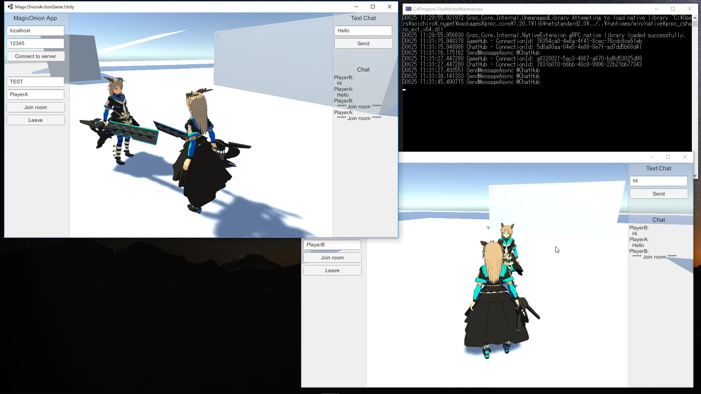

# MagicOnion Example Action Game

[Watch on Youtube](https://youtu.be/9nTxbHahXZI)

## Tested Environment
- Unity 2018.3.14f1
- Visual Studio 2019
- Windows 10 Pro

## Third party assets
The following assets are included in this project.
- [MagicOnion 2.1.0(2.1.2)](https://github.com/Cysharp/MagicOnion/releases/tag/2.1.0)  
  Licensed under the MIT License. Copyright (c) 2016 Yoshifumi Kawai

- [MessagePack.Unity.1.7.3.5](https://github.com/neuecc/MessagePack-CSharp/releases/tag/v.1.7.3.5)  
  Licensed under the MIT License. Copyright (c) 2017 Yoshifumi Kawai

- [grpc_unity_package.1.20.0-dev](https://packages.grpc.io/archive/2019/03/ade5193c3fbbcd2c6992edb6ab5b81e146b77140-0361f006-64f5-4261-a455-9e4836367862/index.xml)  

- [Unity-Chan 3D Model Data](http://unity-chan.com/download/releaseNote.php?id=UnityChan&lang=en)  
  Licensed under the UCL2.0. (C) Unity Technologies Japan/UCL

- [Battle Costume Unity-chan from The Phantom Knowledge. (Humanoid Edition)](http://unity-chan.com/download/releaseNote.php?id=TPK-Hmnd-Kohaku_A&lang=en)  
  Licensed under the UCL2.0. (C) Unity Technologies Japan/UCL
